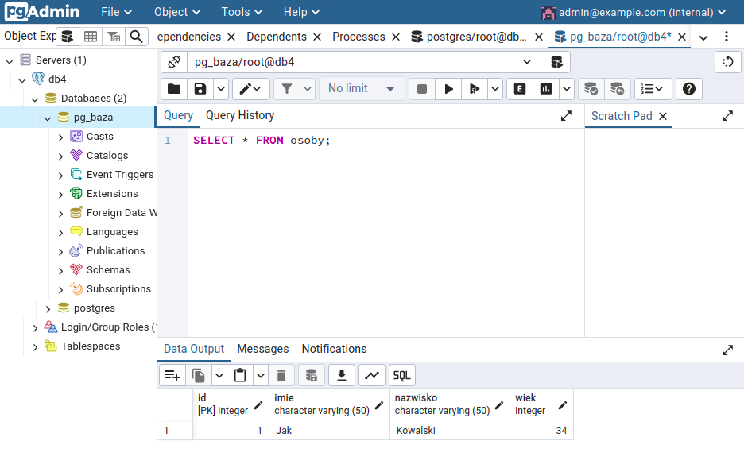

# K8S Deployment 2 

## Create cluster with only one worker-node.

openstack coe cluster create \
--cluster-template k8s-stable-localstorage-1.22.5 \
--docker-volume-size 10 \
--labels auto_healing_enabled=true,floating-ip-enabled=true \
--merge-labels \
--keypair klucz31 \
--master-count 1 \
--node-count 1 \
--timeout 190 \
--master-flavor eo1.large \
--flavor eo1.large \
k8s-postgres-final

## Create and execute manifest yaml with necessary elements.

To start postgres which including pvc, deploys, configmaps, secrets and services, execute:

```
kubectl apply -f postgres_start.yaml
```

## Create a table with records.

After create all elements, login into postgres pod, for example "postgres-deployment-cdcf8b59d-876zc":
```
kubectl exec -it postgres-deployment-cdcf8b59d-876zc -- sh
```
And execute the following steps to configure postgres:
```
su - postgres
psql

CREATE DATABASE pg_baza;
\c pg_baza

CREATE TABLE IF NOT EXISTS osoby (
  id SERIAL PRIMARY KEY,
  imie VARCHAR(50),
  nazwisko VARCHAR(50),
  wiek INTEGER
);

INSERT INTO osoby (imie, nazwisko, wiek) VALUES ('Jan', 'Kowalski', 34);

SELECT * FROM osoby;

 id | imie | nazwisko | wiek 
----+------+----------+------
  1 | Jan  | Kowalski |   34
(1 row)

CREATE USER root WITH PASSWORD 'root;
ALTER USER root WITH SUPERUSER;
```
## Expose pgadmin4 service on the FIP.

To do that execute the following command:

```
kubectl expose deploy pgadmin-deployment --port=80 --type=LoadBalancer
```
Then wait about 4 minutes to LoadBalancer is pending FIP automatically.
Check pgadmin-deployment is exposed:
```
kubectl get svc
```
It should looks like:
```
service/pgadmin-deployment    LoadBalancer   10.254.153.174   <FIP>   80:30528/TCP     6h20m
```

## Customizing app to visualize records from base on internet browser.

Paste <FIP> to the web browser and login using:
```
username: admin@example.com
password: admin
```
Wchich are saved in pgadmin-secret and encoded in base64.
Check IP postgres-service, for example:
```
service/postgres-service      NodePort       10.254.176.148   <none>          5432:30009/TCP   6h25m
```
And use it to add new server on the pgadmin webpage with the following data:
```
General:
Name (db): any, for example db4

Connection:
Host name/address: 10.254.176.148 (IP postgres-service)
Port: 5432
Maintenance database: postgres
Username: root (saved in postgres-secret and encoded in base64)
Password: root (saved in postgres-secret and encoded in base64)
```
and click save.

To check records in table in pg_baza database use query:
```
SELECT * FROM osoby;
```
```
 id | imie | nazwisko | wiek 
----+------+----------+------
  1 | Jak  | Kowalski |   34
```

